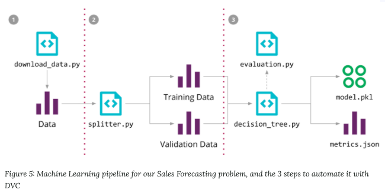
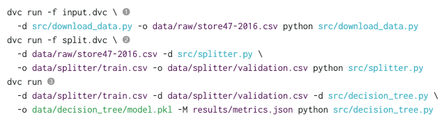
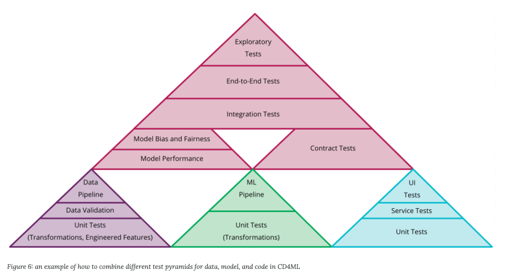
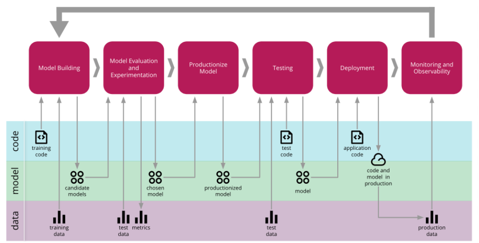

---
title<br>"Continuous Delivery for Machine Learning"
source<br>https://martinfowler.com/articles/cd4ml.html
date<br>2020-05-06 08:00:00
categories<br>data engineering
---
<h1>Simple translation</h1>
<h2>Introduction and Definition</h2>
머신러닝 개발 과정은 기존의 소프트웨어 과정보다 복잡하다. 코드 그 자체, 모델, 데이터 이 세 가지 방향으로의 변화가 있을 수 있다. 기존의 Continuous Delivery를 뛰어넘어 ML을 위한 배포 방법을 CD4ML(Continuous Delivery for Machine Learning)이라 칭하도록 하겠다.

```Continuous Delivery for Machine Learning (CD4ML) is a software engineering approach in which a cross-functional team produces machine learning applications based on code, data, and models in small and safe increments that can be reproduced and reliably released at any time, in short adaptation cycles.```

* Software engineering approach<br>팀이 높은 품질의 소프트웨어를 만들게 한다.
* Cross-functional team<br>서로 다른 팀이 자신의 강점을 사용하여 협업할 수 있게 한다.
* Producing software based on code, data, and machine learning models<br>ML을 위한 서로 다른 툴과 워크플로우는 각각 버저닝되고 관리되도록 한다.
* Small and safe increments<br>조금씩 개선되는 코드는 코드를 읽기 쉽게 하고, 결과의 변동을 통제하게 하며, 안정성을 높인다.
* Reproducible and reliable software release<br>ML 모델은 non-deterministic하고 재생산되지 않을 수 있지만 배포 과정은 신뢰할 수 있고 재생산 가능하며 최대한 자동화되어야 한다.
* Software release at any time<br>언제든 배포될 수 있도록 준비되어야 한다.
* Short adaptation cycles<br>개발 cycle을 짧게 하여 빠른 피드백을 받을 수 있게 한다.

<h2>Technical Components of CD4ML</h2>

<h3>Discoverable and Accessible Data</h3>
데이터 사이언티스가 쉽게 접근하고 사용할 수 있도록 해야한다. 데이터셋의 버전 관리도 필요한데 이 방법은 Data Versioning 포스트를 보도록 해라.

<h3>Reproducible Model Training</h3>
거대한 input data와 output model을 source control platform에서 관리를 할 수는 없다. 또한 모델 학습 파이프라인은 끊임없이 변화하기 때문에 재생산이 매우 어렵다. 이러한 두 가지 문제를 보완하기 위해서  DVC(Data Science Version Control)를 도입하였다. 

DVC의 장점은 다음과 같다.
* source control repository의 바깥에 있는 외부 저장소에 데이터를 가져오고 저장하기 위한 다양한 플러그인이 지원된다.
* 파일들의 버전을 관리해준다. 최신 데이터가 변하는 경우가 생겨도 버전을 이용하여 재학습이 가능하다.
* 의존성 그래프(dependency graph)와 ML 파이프라인에서 사용된 명령어들을 추적함으로써, 다른 환경에서도 동일한 과정을 진행할 수 있도록 해준다.
* Git branch와 통합될 수 있다. 이는 다수의 실험이 동시에 가능하도록 한다.



위의 파이프라인을 DVC 코드로 아래와 같이 표현된다.



각 run은 대응되는 파일을 만들고 이것들은 version conttrol이 된다. `dvc repro` 명령문을 사용하면 다른 사람들도 동일한 파이프라인을 다시 실행할 수 있도록 한다. 또한  `dvc push`와 `dvc pull` 를 이용하여 외부 쓰토리지에 배포하거나 가져올 수 있다. 다른 오픈소스 툴로 존재하는데 Pachyderm과 MLflow Projects가 존재한다. 각 특징이 있지만 DVC는 간단한 CLI를 지원하기에 DVC를 선택하였다.

<h3>Model Serving</h3>
모델을 배포하는 몇 가지 패턴이 있다.

* Embedded model<br>model artifact를 의존성으로 바라본다. 즉 application 내에서 함께 built 되고 packaged 된다. application artifact와 version을 application code와 model의 조합으로 사용한다.
* Model deployed as a separate service<br>model이 독립적인 서비스로 사용된다. 이는 모델이 독립적이라는 장점이 있지만 inference에서 사용되는 latency와 remote invocation(원격 요청)이 필요하다.
* Model published as data<br>해당 케이스도 model은 독립적으로 사용된다. 하지만 application은 모델을 런타임에 사용하는 데이터로 생각한다. 해당 케이스는 모델의 새로운 버전이 만들어질 때마다 이를 subscribe 하고, 이전 버전의 모델로 예측을 하면서 새로운 버전의 모델을 소화할 수 있는 스트리밍/실시간 시나리오에서 사용된다. 소프트웨어 release pattern은 Blue Green Deployment 또는 Canary Releases 패턴을 사용할 수 있다.

저자는 embedded model을 사용했다. python으로 model을 만들고 이를 serialized object(pickle file)로 만든다. 이는 DVC에 의해 저장소로 보내진다. application을 만들 때, 해당 object를 Docker 컨테이너에 넣은 뒤 배포를 진행한다. 이 경우 Docker image로 version을 달고 producttion에 배포된다.

이 외에도 다른 방법들이 존재한다. MLeap은 Spark, scikit-learn, Tensorflow 모델을 지원하는 serialization을 제공한다. 이는 또한  PMML, PFA, ONNX와 같은 language-agnostic(언어에 상관없는) serialization 포맷도 제공한다. 이는 Model published as data 패턴에도 사용될 수 있다.

H2O는 모델을 JAR java 라이브러리의 POJO로 모델을 내보낸다. 이 접근의 장점은 데이터 사이언티스트에게 친근한 언어로 모델을 학습할 수 있다는 것과 모델을 다른 JVM에서 구동되는 컴파일된 바이너리로 내보낼 수 있다는 것이다. 즉 JVM을 사용하는 더 좋은 환경에서 inference에 속도를 낼 수도 있다.

Model을 service로 배포하는 패턴은 많은 회사들이 MLaaS로 제공하고 있다. 예를 들면 Azure Machine Learning, AWS Sagemaker, Google AI Platform이 있다. 또 다른 옵션으로 kubeflow를 쓰는 방안도 있다. 이는 ML workflow를 Kubernetes에 배포하기 위해 사용된다.

MLflow Models은 모델을 패키징하는 표준화된 방법을 제공하기 위해 노력하고 있다. 이는 다운스트림에서 MLaaS 또는 embedded model 패턴에서 사용할 수 있다. 하지만 현재 이 방법론은 명확한 승자가 없고 계속 발전 중이기에 많은 평가가 필요하다.

<h3>Testing and Quality in Machine Learning</h3>
사용자와 모델 사이에는 데이터 형식이라는 숨겨진 계약이 있다. 만약 이 계약이 갑자기 바뀐다면 이는 integration issue를 만들고 application을 망가뜨릴 것이다. 이를 해결하기 위해 testing의 개념이 필요하다. ML workflow에서 가능한 테스트들을 알아보자.

* Validating data<br>데이터가 기대한 형태 또는 범위가 맞는지에 대하여 테스트한다.
* Validating component integration<br>다른 서비스 사이의 integration test와 유사하다. Contract Test를 통하여 model의 인터페이스와 application이 적합한지 또는 모델의 포멧이 달라진다면 기존 모델과 동일한 결과가 나오는지를 테스트한다.
* Validating the model quality<br>다수의 metric을 활용하여 새로운 모델이 성능을 떨어뜨리지는 않는지 테스트한다.
* Validating model bias and fairness<br>training을 할 때의 데이터 분포는 실제 세상에서의 분포보다 훨씬 클 것이다. 따라서 특정 데이터에 대한 기준점을 통과하는지에 대한 테스트가 필요하다. Facets와 같은 툴은 데이터 조각과 값의 분포를 시각화시키는 것을 도와준다.

테스트에서도 동일한 데이터를 계속 사용할 경우 overfitting의 문제가 있고, 숨어있는 데이터들에 대해서는 성능이 떨어질 수 있다. 따라서 좋은 데이터를 테스트에서 사용하는 것이 매우 중요하다.

만약 모델이 서로 다른 application에 의해 사용되도록 분산되어 있다면 각 모델의 training과 serving 때의 데이터가 다를 수 있다. 따라서 이 때는 application들이 통합된 이후에 데이터에 대한 평가를 진행하여 해결해야 할 것이다. 기존 소프트웨어 개발의 integration teset와 비슷한 방식이다.

하지만 배포 파이프라인 사이에 수작업이 들어가는 부분이 있는 것이 매우 중요하다고 생각한다. 모델의 정보를 파악하고 이를 사용할지에 대하 사람이 판단하는 것이다. 이를 통해 ML 관리 과정을 체계화하고, 모델의 bias/fairness를 점검하는 방법을 도입하고, 모델의 정보를 모을 수 있다.

CD4ML의 data, model, code를 위한 테스트 피라미드는 다음 그림으로 표현될 수 있다.



<h3>Experiments Tracking</h3>
ML 실험은 기존 소프트웨어 개발의 실험과 다르게 많은 모델에 대한 실험이 진행되지만 그 중 production까지 가는 모델은 소수이다. 이를 쉽게 하기 위해 저자는 DVC에서 제시되는 접근 방법을 따르기로 했다. 이는 하나의 branch가 하나의 실험을 담당하는 것이다. 또한 DVC는 다른 브런치, 태그로부터 실험 결과를 가져오고 보여주는 기능이 있다. 이처럼 다수의 브런치에서 각각 실험을 진행하는 것은 추후 merge에서 문제가 될 수 있다. 하지만 저자는 대다수의 branch가 merge되지 않을 것을 가정하기에 이는 ML 실험에 적합한 방법이다.

이 외에도 MLflow도 실험 추적 기능을 제공한다. hosted service로 배포되며 시각화를 위한 API와 인터페이스를 제공한다. 이런 실험들을 지원하기 위해 다양한 환경 구축이 필요할 수 있고 이는 cloud를 사용하는 것을 추천한다.

<h3>Model Deployment</h3>
저자는 하나의 모델을 embedded로 배포하였지만 실제로는 훨씬 다양한 상황이 존재한다.

* Multiple models<br>
하나의 task에 대해 여러 모델이 예측을 수행하는 경우, 각 모델을 분리된 서비스로 배포할 수 있다.

* Shadow models<br>
현재 productioin level의 모델을 교체할 때 사용할 수 있다. 현재 model과 나란하게 배포를 하여 실제 사용하기 전에 production의 데이터를 받아서 데이터를 모으고 모델을 점검하는 방법이다.

* Competing models<br>
모델의 다른 버전들을 사용하는 경우이다. 이 경우 A/B test와 같이 어떤 모델이 더 나은지 판단하고자 한다. Multi-Armed Bandits라는 다수의 모델을 비교하는 방법이 있다. 이를 ML에 적용하는 것은 아직 활발한 작업 중이고 Seldon core 그리고 Azure Personalizer와 같은 tool이 등장하고 있다.

* Online learning models<br>
이는 다른 model들과 다르게 online으로 데이터가 들어오면 바로 traininig과 inference를 함께 진행하는 방법이다. 이는 training data 뿐 아니라 production data 또한 모델의 성능에 영향을 미치기에 둘 다 versioning을 진행해야 한다.

<h3>Continuous Delivery Orchestration</h3>
CD4ML은 인프라의 권한 관리, training과 다수의 실험 결과를 저장하기 위한 ML 파이프라인, 다른 testing과 validation 과정을 추가로 고려하여야 한다. 저자는 이를 위해 GoCD를 Continuous Delivery 툴로 채택했다. 이 시스템이 파이프라인의 개념을 적용했기 때문이었다. 이 뿐아니라 GoCD는 복잡한 workflow와 dependency을 설정할 수 있게 한다. 다른 파이프라인/트리거들의 결합, 파이프라인 간의 manual/automated 배포 순서의 정의 기능을 제공한다. 만약 다수의 실험을 하고자 한다면 GoCD의 fan-out/fan-in 기능도 지원된다.

한 가지 주의할 사안은 rollbacks 프로세스를 정의하는 것이다. 잘못된 수행이 이루어졌을 때, 파이프라인의 안정성을 위해서이다.

<h3>Model Monitoring and Observability</h3>
다음 사안들을 모니터링하도록 한다.

* Model input<br>
어떤 데이터가 들어오는지를 모니터링한다.

* Model interpretability outputs<br>
모델이 어떻게 동작하는지에 대한 정보를 모니터링한다. Model coefficients에 대한 metrics, ELI5, LIME의 결과물들은 모델이 어떻게 동작하는지에 대한 정보를 제공할 수 있다. 이를 통하여 잠재적인 overfitting, bias 등을 점검할 수 있다.

* Model outputs and decisions<br>
모델이 만들어내는 결과와 이 결과로 인한 결정 사항에 대한 정보를 모니터링한다. 종종 application은 model을 무시하고 사전 정의된 로직에 따라 결정을 내리는 경우도 존재한다.

* User action and rewards<br>
유저의 활동과 반응에 대한 정보를 모니터링한다. 이를 이용하여 모델이 의도한 결과를 내고 있는지 확인할 수 있다.

* Model fairness<br>
bias가 생길 수 있는 feature에 대하여 input/output을 분석한다.

저자는 monitoring/observability을 위해 EFK stack을 사용했다. 
* E(Elasticsearch): 오픈 소스 서치 엔진
* F(FluentD): 오픈 소스 데이터 collector
* K(Kibana): Elasticsearch로 인덱스된 데이터의 탐색과 시각화를 위한 오픈 소스 웹 UI

이 외에도 ELK(FluentD 대신 Logstash 사용), Splunk 등이 존재한다.

<h2>The End-to-End CD4ML Process</h2>
전체 프로세스는 다음과 같다.



<h2>Where do We Go From Here?</h2>

<h3>Data Versioning</h3>


<h1>My summary</h1>
모든 테스트가 통과한 뒤에 특정 데이터 조각에 대한 테스르를 진행하는 점은 생각해보지 못 했던 부분이었다.
Deployment pipeline 중간에 사람이 개입하는 부분을 고려해야 한다는 사안이 매우 인상 깊다.
