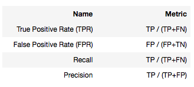
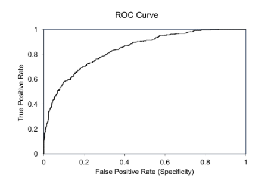

<h1>단순 번역 및 요약</h1>
데이터 불균형은 majority class의 데이터에 대한 심각한 편향을 야기한다. 이는 성능을 저하시키고 FN(False Negative)를 증가시킨다. 이 문제를 어떻게 완화시킬 수 있을까? 가장 흔한 방법은 데이터 샘플링이다. majority class의 데이터에 대한 under-sampling, minority class의 데이터에 대해 over-sampling, 또는 이 두개의 혼합 버전이 있다. 이는 성능을 향상시킬 것이다. 이 글에서 나는 불균형 데이터가 무엇인지 설명하고, 왜 ROC가 정확한 측정을 할 수 없는지, 그리고 이를 해결할 방법을 다룰 것이다. 각 방법에 대한 python code도 첨부하였다.

<h3>What is imbalanced data?</h3>
Target field의 데이터의 비율이 다른 경우를 의미한다. 예를 들어 fraud detection을 한다고 할 경우 fraud는 minority class이기에 이러한 데이터가 imbalanced data가 되는 것이다.

<h3>Why a ROC curve cannot measure well?</h3>

* Labels

* Metics

* ROC Curve

중요한 것은 ROC curve에 사용되는 지표를 보면 negative labels의 갯수에 영향을 받지 않는다. TPR은 negative와는 관련이 없고 FPR은 negative labels의 갯수에 영향을 받지만 동일한 성능을 가진 모델에 대해서 FP와 TN은 비슷한 비율로 증가할 것이기에 값의 큰 변화는 없다. 즉 imbalanced data를 평가할 때 이는 좋은 지표가 되지 않는다. Davis와 goadrich는 편향된 데이터를 다룰 때 Precision-Recall curves가 ROC Curves보다 더 많은 정보를 제공할 것이라고 합니다. Precision은 imbalanced 데이터에 직접적인 영향을 받기 때문입니다. 만약 imbalanced data를 가지고 다른 두 개의 모델을 비교한다면, AUPRC가 AUROC보다 더 정확합니다.

<h3>What are the remedies?</h3>
크게 3가지 방법이 있습니다. 데이터 샘플링, 알고리즘 수정, cost-sensitive learning입니다. 여기서는 데이터 샘플링에 대해 이야기해보겠습니다.

<h3>What are the remedies?</h3>

1. Random under-sampling for the majority class
> majority class 데이터 중 일부를 샘플링하여 진행하는 방법입니다. 정보 손실의 위험은 존재합니다.

2. NearMiss
> 정보 손실 문제를 줄이기 위해 고안된 방법입니다. 기본 알고리즘은 다음과 같습니다.
> * NearMiss-1 기법은 가장 가까운 minotiry class의 데이터 3개의 거리의 평균이 가장 가까운 majority class를 선택합니다.
> * NearMiss-2 기법은 가장 먼 minotiry class의 데이터 3개의 거리의 평균이 가장 먼 majority class를 선택합니다.
> * NearMiss-3 기법은 각 minotiry class에서 가장 가까운 k개를 선택합니다.

3. Condensed Nearest Neighbor Rule (CNN)
> 모델의 성능에 영향을 미치지 않는 불필요한 데이터를 제거하는 방법입니다.
>> 1. 두 개의 빈 데이터 셋 A, B를 만듭니다.
>> 2. 처음 데이터를 A에, 나머지를 B에 넣습니다.
>> 3. A 데이터 셋으로 학습을 진행합니다.
>> 4. B의 데이터 하나를 선택하여 학습한 모델로 예측을 진행합니다.
>> 5. 예측이 틀릴 경우, 선택한 데이터를 A로 이전합니다.
>> 6. 위 과정을 B에서 A로 가는 데이터가 없을 때까지 1번부터 반복합니다.

4. TomekLinks
> 서로 다른 class에서 하나씩 데이터(a, b)를 정하여 거리를 구합니다. 이 거리를 d(a, b)라고 할 때 모든 다른 데이터 c에 대하여 d(a, c) < d(a, b) 또는 d(b, c) < d(a, b)를 만족하는 c가 없다면 a, b는 Tomek link라고 부릅니다. Tomek links는 경계선이거나 noise일 것입니다. 따라서 이들을 제거합니다.

5. Edited Nearest Neighbor Rule (ENN)
> ENN은 각 데이터에 대하여 가까운 3개 데이터의 class를 확인합니다. 만약 3개 중 2개 이상의 클래스와 타겟 데이터의 클래스와 다르다면 해당 데이터를 제거합니다.

6. NeighbourhoodCleaningRule (NCL)
> 이 방법은 ENN을 majority class에만 적용을 하는 경우입니다. 타겟 데이터가 majority class이고 주위의 데이터가 minority class일 경우, 타겟 데이터를 제거합니다. 반대로 타겟 데이터가 minority class이고 주위의 데이터가 majority class라면 주위의 majority class들을 제거합니다.

7. ClusterCentroids
> Majority class의 K-means를 적용하여 cluster들을 찾아냅니다. 이 중 N개 cluster의 centroid를 새로운 majority class로 사용합니다.

<h3>Python Code</h3>
원문을 참고하시길 바랍니다.

<h3>Reference</h3>

[The Relationship Between Precision-Recall and ROC Curves](https://ftp.cs.wisc.edu/machine-learning/shavlik-group/davis.icml06.pdf)

<h1>내 의견</h1>

* 먼저 중요하게 생각해야 할 것은 AUROC, AUPRC 모두 두 개의 모델의 성능을 비교하기 위한 지표이다. 이 때 imbalanced data에 대해서는 AUPRC를 사용해야 한다. 간단하게 예를 들어보면 쉬울 것 같다. 처음 balanced된 데이터로 TP/TN/FP/FN를 임의로 할당해보자. 이후 imbalanced data를 가정하기 위해 negative 데이터만 추가로 들어온다고 했을 때, FP와 TN은 점점 커질 것이다. 이 때 AUROC는 TPR(=TP/(TP+FN)), FPR(=FP/(TN+FP))로 구성되어 있기 때문에 negative 데이터가 추가로 들어와도 TPR과 FPR의 값이 동일하다. 즉 balance의 영향을 받지 않는다. 하지만 AUPRC는 precision(=TP/(TP+FP))와 recall(=TP/(TP+FN))로 구성되어 있기 때문에 동일한 모델의 성능이라면 skewed가 될수록 precision 값이 낮아지게 된다. 즉 balance에 영향을 받는다. 두 개의 모델을 만들었다면 imbalanced data에서 AUPRC가 더 높은 모델을 선택해야할 것이다.
* 해당 글은 imbalanced data를 마주했을 때 사용할 수 있는 다양한 샘플링 기법에 대해 자세히 다루고 있다.
