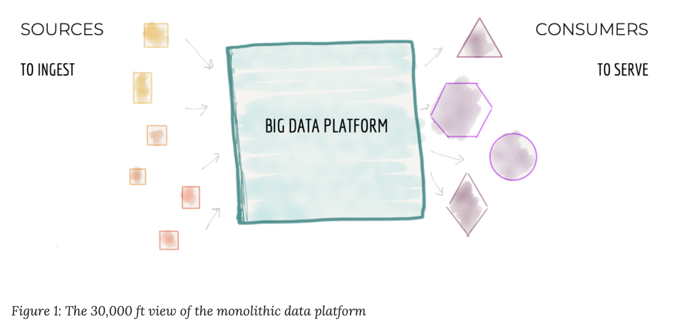
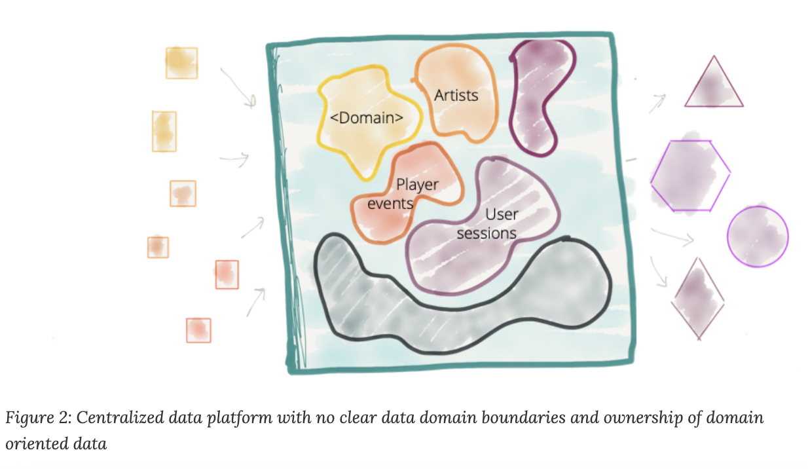
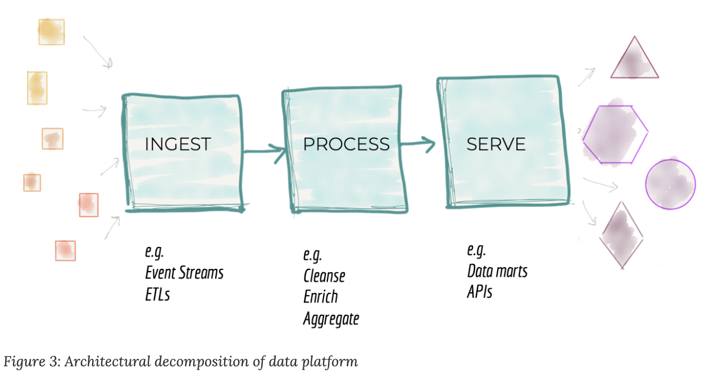
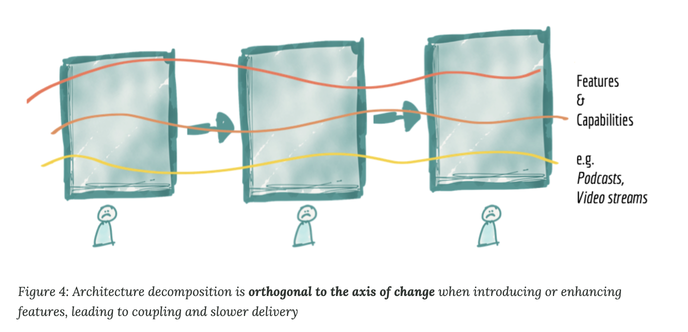
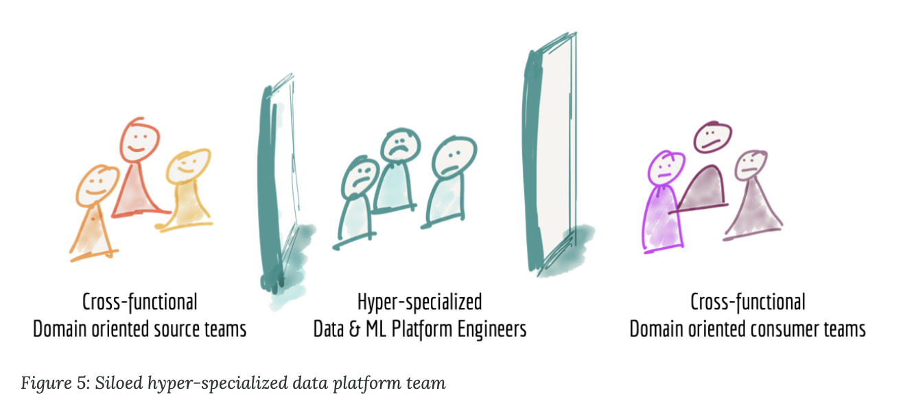
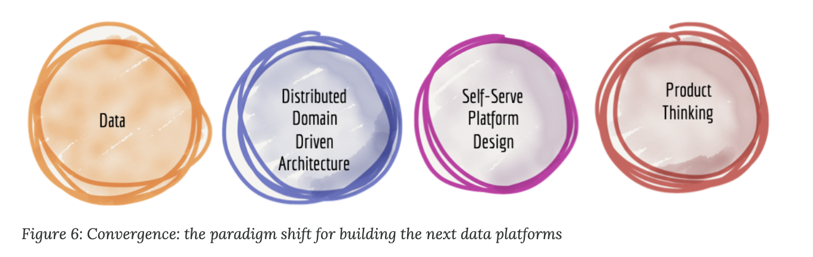
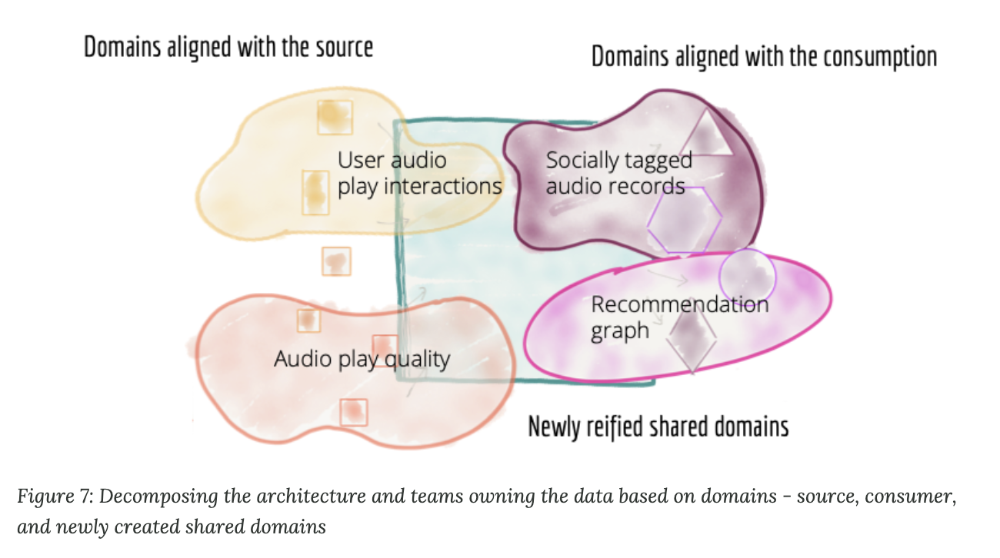
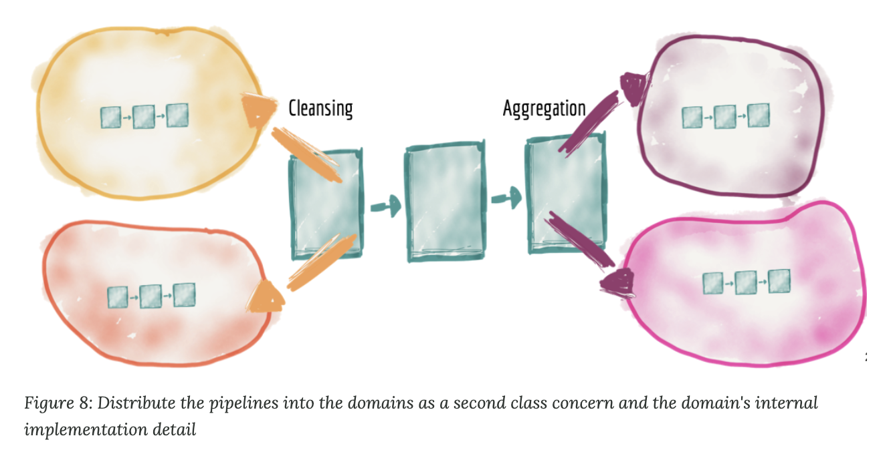

<h2>How to Move Beyond a Monolithic Data Lake to a Distributed Data Mesh   어떻게 단일 데이터 레이크에서 분산된 데이터 매쉬로 넘어갈 것인가</h2>
Many enterprises are investing in their next generation data lake, with the hope of democratizing data at scale to provide business insights and ultimately make automated intelligent decisions. Data platforms based on the data lake architecture have common failure modes that lead to unfulfilled promises at scale. To address these failure modes we need to shift from the centralized paradigm of a lake, or its predecessor data warehouse. We need to shift to a paradigm that draws from modern distributed architecture: considering domains as the first class concern, applying platform thinking to create self-serve data infrastructure, and treating data as a product.

많은 기업들은 데이터가 사업 크기에 상관없이 비즈니스 인사이트를 제공하고 궁극적으로 자동화된 지능화 결정을 할 수 있기를 희망하며, 그들의 다음 세대 데이터 레이크를 위하여 투자하고 있다. 데이터 레이크 구조에 기반하는 데이터 플랫폼들은 사업 크기에 대응하기 어려운 공통적인 문제점으 가지고 있었다. 이러한 문제점을 해결하기 위해, 우리는 중앙 집중화된 레이크의 페러다임 또는 그 이전의 데이터 웨어하우스로부터 변화할 필요가 있다. 우리는 최신의 분산된 아키텍쳐를 가지는 페러다임으로 변화할 필요가 있다: 도메인을 첫 번째 주제로 고려하기, 셀프 서빙되는 데이터 인프라을 고려한 플랫폼을 적용하기, 그리고 데이터를 프로덕트처럼 대우하기

Becoming a data-driven organization remains one of the top strategic goals of many companies I work with. My clients are well aware of the benefits of becoming intelligently empowered: providing the best customer experience based on data and hyper-personalization; reducing operational costs and time through data-driven optimizations; and giving employees super powers with trend analysis and business intelligence. They have been investing heavily in building enablers such as data and intelligence platforms. Despite increasing effort and investment in building such enabling platforms, the organizations find the results middling.

데이터 기반의 조직이 되어가는 것은 내가 함께 일하는 많은 회사들의 첫 번째 전략 목표이다. 나의 고객들은 지능적인 파워를 갖는 것의 이득을 잘 알고 있다: 데이터와 고도화된 개인화의 기반한 최고의 소비자 경험을 제공하는 것; 그리고 직원들에게 트렌드 분석 그리고 비즈니스 인텔리전폼트와 같은 능력을 주는 것. 그들은 데이터와 인텔리전트 플랫폼과 같은 것들을 만들기 위해 엄청난 투자를 하고 있다. 몇 가능한 플랫폼을 만드는데 드는 노력과 투자가 증가함에도 불구하고, 그 기업들은 그저그런 결과들을 찾는다.

I agree that organizations face a multi-faceted complexity in transforming to become data-driven; migrating from decades of legacy systems, resistance of legacy culture to rely on data, and ever competing business priorities. However what I would like to share with you is an architectural perspective that underpins the failure of many data platform initiatives. I demonstrate how we can adapt and apply the learnings of the past decade in building distributed architectures at scale, to the domain of data; and I will introduce a new enterprise data architecture that I call data mesh.

나는 많은 기업들이 데이터 기반으로 전환하는 것에 대해 다수의 복잡함에 직면하는 것에 동의한다; 수십년간 지속된 이전 시스템에서 이동하는 것, 데이터에 기반한 이전의 문화에 대한 저항, 그리고 사업 우선순위에 대한 경쟁까지. 하지만 내가 여러분과 공유하고 싶은 것은 많은 데이터 플랫폼 초기 모델의 실패에 대한 주장을 뒷받침하기 위한 아키텍쳐적 관점이다. 나는 데이터 도메인을 위한, 사업 크기에 대응할 수 있는 분산된 아키텍쳐를 만드는 것에 대해 지난 기간동안 배운것을 어떻게 우리가 적응하고 적용했는지에 대해 이야기할 것이다; 그리고 나는 data mesh라고 불리 새로운 사업 아키텍쳐를 제안할 것이다.

My ask before reading on is to momentarily suspend the deep assumptions and biases that the current paradigm of traditional data platform architecture has established; Be open to the possibility of moving beyond the monolithic and centralized data lakes to an intentionally distributed data mesh architecture; Embrace the reality of ever present, ubiquitous and distributed nature of data.

이 글을 읽기 전 나의 요구는 들전통적인 데이터 플랫폼 아키텍쳐들이 쌓아왔던 많은 가정과 편견들을 잠시동안 보류하는 것이다; 단일화 그리고 중앙 집중화된 데이터 레이크를 넘어서 의도적으로 분산되는 데이터 매쉬 아키텍쳐로 넘어가는 것에 대해 열린 마음을 가져라; 이미 존재하고, 어느 곳에나 있으며, 분산되어있는 데이터의 본성의 현실성을 받아들여라.

<h2>The current enterprise data platform architecture 현재 기업들의 데이터 플랫폼 아키텍쳐</h2>

It is centralized, monolithic and domain agnostic aka data lake. Almost every client I work with is either planning or building their 3rd generation data and intelligence platform, while admitting the failures of the past generations:

- The first generation: proprietary enterprise data warehouse and business intelligence platforms; solutions with large price tags that have left companies with equally large amounts of technical debt; Technical debt in thousands of unmaintable ETL jobs, tables and reports that only a small group of specialized people understand, resulting in an under-realized positive impact on the business.
- The second generation: big data ecosystem with a data lake as a silver bullet; complex big data ecosystem and long running batch jobs operated by a central team of hyper-specialized data engineers have created data lake monsters that at best has enabled pockets of R&D analytics; over promised and under realized.

이것은 중앙 집중화, 단일적 그리고 도메인에 집중되어 있다. 일명 데이터 레이라고 한다. 나와 함께 일하는 대부분 고객들은 과거 세대들의 실패 사례를 수용하면서 그들의 3세대 데이터 지식 플랫폼을 계획하거나 만들고 있다.

- 1세대 : 회사의 소유 data warehouse 그리고 business intelligence 플랫폼; 회사에 거대한 기술적 부채를 요구하는 가격 태그가 있는 솔루션; 유지할 수 없는 수천가지의 ETL jobs, 테이블 그리고 특정 그룹만 이해할 수 있는 보고서는 business에 있어서 매우 낮은 성과를 보인다.
- 2세대 : data lake를 소유한 big data 시스템; 복잡한 big data 시스템 그리고 전문 데이터 엔지니어에 의해 작동되는 시간이 오래 걸리는 batch job들은 data lake라는 괴물(R&D 분석을 가능하게 하였지만 과하게 뛰어나며 이해하기 어렵다.)을 만들었다.

The third and current generation data platforms are more or less similar to the previous generation, with a modern twist towards (a) streaming for real-time data availability with architectures such as Kappa, (b) unifying the batch and stream processing for data transformation with frameworks such as Apache Beam, as well as (c) fully embracing cloud based managed services for storage, data pipeline execution engines and machine learning platforms. It is evident that the third generation data platform is addressing some of the gaps of the previous generations such as real-time data analytics, as well as reducing the cost of managing big data infrastructure. However it suffers from many of the underlying characteristics that led to the failures of the previous generations.

3세대 그리고 현재의 데이터 플랫폼은 이전의 세대들과는 다르다. 현대적인 필요성을 추구한다. (a) Kappa와 같은 아키텍쳐를 이용하여 실시간 데이터 사용을 가능하게 한다. (b) Apache Beam과 같은 데이터 변형 과정을 위한 batch와 steram processing을 통합한다. (c) 스토리지를 위한 클라우드 기반의 서비스, 데이터 파이프라인 실행 엔진, 머신러닝 플랫폼을 완전하게 수용한다. 3세대 데이터 플랫폼은 이전 세대들이 할 수 없었던 실시간 데이터 분석, 빅데이터 분석을 관리하는데 필요한 비용 감소를 가능하게 한다. 하지만 3세대 시스템은 이전 세대들이 가져왔던 근본적인 특성들로 인해 고통을 받는다.

<h3>Architectural failure modes   아키텍쳐 실패 사례</h3>
To unpack the underlying limitations that all generations of data platforms carry, let's look at their architecture and their characteristics. In this writeup I use the domain of internet media streaming business such as Spotify, SoundCloud, Apple iTunes, etc. as the example to clarify some of the concepts.

모든 세대의 데이터 플랫폼이 가졌던 근본적인 제한을 알아보기 위해, 그들의 아키텍처와 특성에 대해 알아보자. 이 글에서 나는 몇 개념을 명확하게 하기 위해 Spotify, SoundCloud, Apple iTunes과 같은 internet media streaming business의 지식을 사용한다.

<h4>Centralized and monolithic   중앙 집중적 그리고 단일적</h4>
At 30,000 feet the data platform architecture looks like Figure 1 below; a centralized piece of architecture whose goal is to:
- Ingest data from all corners of the enterprise, ranging from operational and transactional systems and domains that run the business, or external data providers that augment the knowledge of the enterprise. For example in a media streaming business, data platform is responsible for ingesting large variety of data: the 'media players performance', how their 'users interact with the players', 'songs they play', 'artists they follow', as well as 'labels and artists' that the business has onboarded, the 'financial transactions' with the artists, and external market research data such as 'customer demographic' information.
- Cleanse, enrich, and transform the source data into trustworthy data that can address the needs of a diverse set of consumers. In our example, one of the transformations turns the click streams of user interaction to meaningful sessions enriched with details of the user. This attempts to reconstruct the journey and behavior of the user into aggregate views.
- Serve the datasets to a variety of consumers with a diverse set of needs. This ranges from analytical consumption to exploring the data looking for insights, machine learning based decision making, to business intelligence reports that summarize the performance of the business. In our media streaming example, the platform can serve near real-time error and quality information about the media players around the globe through distributed log interfaces such as Kafka or serve the static aggregate views of a particular artist's records being played to drive financial payments calculation to the artists and labels.

30,000feet위에서 바라보면(먼 관점에서 바라보면) 데이터 플랫폼 아키텍쳐는 아래의 그림 1과 같이 생겼다; 중앙 집중형 아키텍쳐의 목표는 다음과 같다:
- operational, transactional 시스템 그리고 사업을 진행하는 영역 또는 사업의 지식을 증가시키는 외부의 데이터 제공과 같은 사업의 모든 영역에 데이터를 소화한다. media streaming business를 예로 들면, 데이터 플랫폼은 다양한 종류의 데이터를 소화하는데 책임이 있다: 사업이 소유하고 있는 '크리에이터의 능력', '어떻게 고객이 크리에이터와 소통하는지', '그들이 틀었던 노래들', '그들이 구독하는 크리에이터들', '레이블과 크리에이터들'에 대한 정보, 그리고 '크리에이터들의 경제 활동', '소비자 인구조사 정보'와 같은 외부 시장 조사 데이터까지.
- 다양한 소비자군의 요구를 다룰 수 있도록, 신뢰있는 데이터안의 소스 데이터를 정리, 추가, 변형해라. 예를 들면, 하나의 변형은 유저의 클릭 데이터를 유저의 정보가 추가된 의미있는 세션으로 변형한다. 이것은 유저의 경험과 행동을 집계된 뷰로 다시 만들도록 시도한다. 
- 다양한 필요성에 의해 다양한 유저에게 데이터를 전달해라. 이것은 사업 인사이트를 위한 데이터 탐험의 분석적인 소비, 머신러닝 기반의 의사 결정부터 사업의 성과를 요약한 business intelligence 보고서까지 아우른다. 우리의 미디어 스트리밍 예시를 보면, 이 플랫폼은 가까운 kafka와 같은 분산된 log 인터페이스를 통하여 거의 실시간에 전 세계적인 크리에이터들에 대한 오류와 퀄리티 정보를 전달할 수 있다. 또는 크리에이터와 레이블간의 정산을 위해 특정 크리에이터에 의해 재생된 레코드에 대한 변화가 없을 집계 뷰를 제공할 수 있다.

It's an accepted convention that the monolithic data platform hosts and owns the data that logically belong to different domains, e.g. 'play events', 'sales KPIs', 'artists', 'albums', 'labels', 'audio', 'podcasts', 'music events', etc.; data from a large number of disparate domains. While over the last decade we have successfully applied domain driven design and bounded context to our operational systems, we have largely disregarded the domain concepts in a data platform. We have moved away from domain oriented data ownership to a centralized domain agnostic data ownership. We pride ourselves on creating the biggest monolith of them all, the big data platform.

단일 데이터 플랫폼은 다른 도메인에 속하는 모든 데이터에 대해 관리하고 소유헤야 하는 것은 당연한 사항이다. 예를 들어, '플레이 이벤트', '판매 KPIs', '아티스트들', '앨범', '레이블', '오디오', '팟캐스트', '음악 이벤트', etc.; 분리된 수많은 도매인들로부터의 데이터. 지난 10년동안 우리는 우리의 operational 시스템들에 도메인 기반의 디자인과 구분되는 영역들을 성공적으로 적용해왔지만, 우리는 데이터 플랫폼 안에서의 도메인 개념을 매우 무시해왔다. 우리는 도메인 기반의 데이터 소유권으로부터 중앙 집중화된 도메인의 소유권으로 움직여왔다. 우리는 모든 데이터를 다루는 우리의 단일 시스템을 만든 우리에 대해 자랑스러워한다.

While this centralized model can work for organizations that have a simpler domain with smaller number of diverse comsumption cases, it fails for enterprises with rich domains, a large number of sources and a diverse set of consumers. There are two pressure points on the architecture and the organizational structure of a centralized data platform that often lead to its failure:

- Ubiquitous data and source proliferation: As more data becomes ubiquitously available, the ability to consume it all and harmonize it in one place under the control of one platform diminishes. Imagine just in the domain of 'customer information', there are an increasing number of sources inside and outside of the boundaries of the organization that provide information about the existing and potential customers. The assumption that we need to ingest and store the data in one place to get value from diverse set of sources is going to constrain our ability to respond to proliferation of data sources. I recognize the need for data users such as data scientists and analysts to process a diverse set of datasets with low overhead, as well as the need to separate the operational systems data usage from the data that is consumed for analytical purposes. But I propose that the existing centralized solution is not the optimal answer for large enterprises with rich domains and continuously added new sources.
- Organizations' innovation agenda and consumer proliferation: Organizations' need for rapid experimentation introduces a larger number of use cases for consumption of the data from the platform. This implies an ever growing number of transformations on the data - aggregates, projections and slices that can satisfy the test and learn cycle of innovation. The long response time to satisfy the data consumer needs has historically been a point of organizational friction and remains to be so in the modern data platform architecture.

While I don't want to give my solution away just yet, I need to clarify that I'm not advocating for a fragmented, siloed domain-oriented data often hidden in the bowels of operational systems; siloed domain data that is hard to discover, make sense of and consume. I am not advocating for multiple fragmented data warehouses that are the results of years of accumulated tech debt. This is a concern that leaders in the industry have voiced. But I argue that the response to these accidental silos of unreachable data is not creating a centralized data platform, with a centralized team who owns and curates the data from all domains. It does not organizationally scale as we have learned and demonstrated above.

중앙 집중화된 모델은 회사에 있어서 더 간단하고 단일한 소비 케이스를 구동할 수 있는 반면에, 이것은 엄청나게 거대한 도메인과 다양한 데이터 소스 다양한 소비자 그룹을 가진 기업들에게는 실패작이었다. 실패를 만들어내는 중앙 집중화된 데이터 플랫폼의 아키텍쳐와 구조들은 2가지 약점이 있다.

- 다양한 소스의 데이터 데이터 소스의 폭발적인 증가: 더 많은 데이터가 다양한 소스에서 이용 가능하게 될수록, 한 곳에서 이 모든 것을 소화하고 이것을 조율하는 능력은 약화된다. 
- 회사의 혁신 방향과 소비자의 갑작스런 증가: 빠른 실험에 대한 기업의 요구들은 플랫폼으로부터의 데이터 사용에 더욱 다양한 use case를 요구한다. 이것은 데이터의 다양한 변환과정을 말한다 - aggregates, projections 그리고 slices들은 테스트와 혁신의 러닝 사이클을 충족할 수 있다. 데이터 소비자의 요구사항을 만족하기 위한 긴 resonse time은 역사적으로 봤을때, 조직적인 마찰의 시발점이 되고, 이는 최신 데이터 아키텍쳐에도 남아있다.

아직 나의 솔루션을 주고 싶지는 않지만, 나는 쪼개지고, 한 곳에 쌓아진, 도메인 기반의 데이터(종종 operational 시스템의 깊은 곳에 숨겨져있는)를 옹호하는 것이 아니라는 것을 명확히 하고 싶다; 발견하거나 이해하고 사용하기 쉽지 않게 쌓여진 도메인 데이터. 나는 기술 부채로 수십년동안 누적되어온 결과물인 쪼개져있는 다수의 데이터 웨어하우스들을 옹호하지 않는다. 이것은 산업의 리더들이 말하는 가장 큰 걱정이다. 그러나 그러한 일시적인 다룰 수 없는 데이터들에 대한 대응은 중앙 집중화된, 모든 도메인으로부터의 데이터를 소유하고 관리하는 중앙 집중화된 팀을 유지하는, 데이터 플랫폼을 만들지 않는 것이라고 말할 수 있다. 이것은 우리가 이전에 말했던 것처럼 조직 단위로 크기를 키워나갈 수 없다.

<h4>Coupled pipeline decomposition   연결된 파이프라인 분리</h4>

The second failure mode of a traditional data platform architecture is related to how we decompose the architecture. At 10,000 feet zooming into the centralized data platform, what we find is an architectural decomposition around the mechanical functions of ingestion, cleansing, aggregation, serving, etc. Architects and technical leaders in organizations decompose an architecture in response to the growth of the platform. As described in the previous section, the need for on-boarding new sources, or responding to new consumers requires the platform to grow. Architects need to find a way to scale the system by breaking it down to its architectural quanta. An architectural quantum, as described in Building Evolutionary Architectures, is an independently deployable component with high functional cohesion, which includes all the structural elements required for the system to function properly. The motivation behind breaking a system down into its architectural quantum is to create independent teams who can each build and operate an architectural quantum. Parallelize work across these teams to reach higher operational scalability and velocity.

옛날 데이터 플랫폼 아키텍쳐의 두 번째 실패 사례는 우리가 아키텍쳐를 어떻게 분리하는가와 관련이 있다. 10,000 feet(조금 더 가까이)에서 중앙 집중화된 데이터 플랫폼을 보면, 우리가 찾은 것은 데이터 수집, 정제, 집계, 전달과 같은 기계적인 기능에 따르는 아키텍쳐적인 분리이다. 조직의 아키텍트들 그리고 기술 리더들은 플랫폼의 성장에 따라 아키텍쳐를 분리한다. 이전 세션에서도 말했지만, 새로운 소스에 대한 온보딩 또는 새로운 소비자에 대한 반응에 대한 필요성은 플랫폼이 커지게 만들었다. 아키텍쳐들은 이것의 아키텍쳐적인 단위들을 쪼갬으로써 시스템을 키울 수 있는 방법을 찾아야 했다. [Building Evolutionary Architectures]에서 명시된 아키텍쳐적인 단위는 이 시스템이 적절히 동작하게 하기 위해 요구되는 모든 구조적인 소단위들의 함수적인 결합성과 함께 독립적으로 배포될 수 있는 단위이다. 아키텍쳐적인 단위들을 나누는 것을 넘어서, 각자 아키텍쳐적인 단위를 만들고 동작시키는 독립적인 팀을 만드는 것이다. 더 높은 시스템 상의 확장성과 속도를 이루기 위해서 팀 사이의 작업들을 병렬화해라.

Given the influence of previous generations of data platforms' architecture, architects decompose the data platform to a pipeline of data processing stages. A pipeline that at a very high level implements a functional cohesion around the technical implementation of processing data; i.e. capabilities of ingestion, preparation, aggregation, serving, etc.

이전 세대의 데이터 플랫폼 아키텍쳐의 영향이 있을 때, 아키텍트들은 데이터 플랫폼을 데이터 프로세싱의 과정에 따라 분리한다. 하나의 파이프라인은 매우 높은 수준에서, 데이터를 프로세싱하는 기술적인 구동 사이에 존재하는 기능적 결합을 이용한다; 즉. 수집, 준비, 집계, 전달의 능력.

Though this model provides some level of scale, by assigning teams to different stages of the pipeline, it has an inherent limitation that slows the delivery of features. It has high coupling between the stages of the pipeline to deliver an independent feature or value. It's decomposed orthogonally to the axis of change.

비록 이런 모델은 다팀 단위로 파이프라인의 다른 부분에 할당함으로써 일정 레벨의 확장성을 제공하지만, 이것은 데이터 전달을 느리게 만든다는 태생적 한계가 있다. 이것은 독립적인 특성 또는 가치를 전달하기 위한 파이프라인의 스테이지간의 높은 결합성을 가진다. 이것은 변화에 대해 직교적으로(관련 없는 방향으로) 분리된다.

Let's look at our media streaming example. Internet media streaming platforms have a strong domain construct around the type of media that they offer. They often start their services with 'songs' and 'albums', and then extend to 'music events', 'podcasts', 'radio shows', 'movies', etc. Enabling a single new feature, such as visibility to the 'podcasts play rate', requires a change in all components of the pipeline. Teams must introduce new ingestion services, new cleansing and preparation as well as aggregates for viewing podcast play rates. This requires synchronization across implementation of different components and release management across teams. Many data platforms provide generic and configuration-based ingestion services that can cope with extensions such as adding new sources easily or modifying the existing sources to minimize the overhead of introducing new sources. However this does not remove an end to end dependency management of introducing new datasets from the consumer point of view. Though on paper, the pipeline architecture might appear as if we have achieved an architectural quantum of a pipeline stage, in practice the whole pipeline i.e. the monolithic platform, is the smallest unit that must change to cater for a new functionality: unlocking a new dataset and making it available for new or existing consumption. This limits our ability to achieve higher velocity and scale in response to new consumers or sources of the data.

우리의 미디어 스트리밍 예시를 보자. 인터넷 미디어 스트리밍 플랫폼들은 그들이 제공하는 다양한 타입의 미디어들 간의 강력한 도메인 구조체를 가지고 있다. 그들은 자주 그들의 서비스를 '노래' 그리고 '앨범'과 함께 그들의 서비스를 시작하고, '음악 이벤트', '팟케스트', '라디오 쇼', '영화'와 같은 것으로 확장해나간다. '팟캐스트 재생률'과 같은 하나의 새로운 기능을 가능하게 하는 것은 파이프라인 내의 모든 단위의 변화를 요구한다. 팀들은 새로운 데이터 수집, 정제, 준비, 집계 서비스를 만들어야 한다. 이것은 다른 구성 단위간의 동기화와 팀을 넘나드는 배포 관리를 요구한다. 많은 데이터 플랫폼은 새로운 소스를 도입하는데 쓰는 에너지를 최소화하면서 새로운 소스를 쉽게 추가하고, 존재하는 소스를 수정하는 확장을 다루기 위한, 일반적이고 config 기반의 수집 서비스를 제공한다. 하지만 이것은 소비자의 관점에서 새로운 데이터셋이 추가되는 것에 대해 end2end의 의존성 관리를 제거하지 못 한다. 비록 이 글에서는 파이프라인 아키텍쳐가 파이프라인 단계를 이용하여 구조적 단위를 이룰 수 있는 것처럼 보이지만, 실제로 단일 플랫폼과 같은 전체 파이프라인은 새로운 기능을 위해 변화하고 주어져야할 가장 작은 유닛이다: 새로운 데이터를 열고, 새로운 또는 이전의 소비들도 이용 가능하도록 만드는 것. 이것은 데이터의 새로운 소비체와 소스를 다루기 위해 더 높은 속도와 크기를 가지고 싶은 우리의 능력을 제한한다.  

<h4>Siloed and hyper-specialized ownership   한 곳으로 수집되고 매우 전문적인 집단에 의한 소유권</h4>

The third failure mode of today's data platforms is related to how we structure the teams who build and own the platform. When we zoom close enough to observe the life of the people who build and operate a data platform, what we find is a group of hyper-specialized data engineers siloed from the operational units of the organization; where the data originates or where it is used and put into actions and decision making. The data platform engineers are not only siloed organizationally but also separated and grouped into a team based on their technical expertise of big data tooling, often absent of business and domain knowledge.

오늘 날의 데이터 플랫폼의 세 번째 실패 경우는 플랫폼을 만들고 소유하는 팀을 어떻게 구성했는가와 관련이 있다. 우리가 데이터 플랫폼을 만들고 유지하는 사람들의 삶을 매우 가까이서 바라봤을 때, 우리는 데이터 엔지니어들이 데이터가 들어오고, 사용되고, 활동과 의사 결정을 만들어내는  operational 영역에 다 같이 있는 것을 알 수 있었다. 데이터 엔지니어들은 구조적으로 한 곳에 뭉쳐있는 것 뿐만 아니라 분리되어있고 그들의 기술 지식을 기반으로 한 곳에 묶여있다. 종종 사업 그리고 도메인에 대한 지식이 없는 상태로.

I personally don't envy the life of a data platform engineer. They need to consume data from teams who have no incentive in providing meaningful, truthful and correct data. They have very little understanding of the source domains that generate the data and lack the domain expertise in their teams. They need to provide data for a diverse set of needs, operational or analytical, without a clear understanding of the application of the data and access to the consuming domain's experts.

나는 개인적으로 데이터 플랫폼 엔지니어의 삶이 부럽지 않다. 그들은 의미있고, 신뢰성있으며 정확한 정보를 제공하는 것에 대한 이득이 없는 팀으로부터 데이터를 소비할 필요가 있다. 그들은 데이터를 만드는 소스 도메인에 대한 이해가 거의 없고 그들의 팀내에서 도메인에 대한 지식이 부족하다. 그들은 명확한 데이터의 쓰임새에 대한 이해 없이 operational 또는 분석적인 다양한 요구에 따라 데이터를 제공하고 소비 도메인의 전문가들에게 다가가야할 필요가 있다.

In the media streaming domain, for example, on the source end we have cross-functional 'media player' teams that provide signals around how users interact with a particular feature they provide e.g. 'play song events', 'purchase events', 'play audio quality', etc.; and on the other end sit the consumer cross-functional teams such as 'song recommendation' team, 'sales team' reporting sales KPIs, 'artists payment team' who calculate and pay artists based on play events, and so on. Sadly, in the middle sits the data platform team that through sheer effort provides suitable data for all sources and consumptions.

예를 들어, 미디어 스트리밍 영역에서, 소스 부분에서 우리는 기능적으로 엮인 '미디어 플레이어' 팀들을 가지고 있다. 이 팀은 그들이 제공하는 특정 기능('노래 이벤트 플레이', '이벤트 구입', '오디오 품질 플레이' 등)에 어떻게 유저가 반응하는지에 대한 반응을 제공한다.; 그리고 다른 한 쪽 끝에서는 소비 부분의 기능적으로 엮인 팀(음악 추천 팀, 매출 KPI를 보고하는 세일즈 팀, 음악 재생에 따라 계산하고 돈을 지불하는 아티스트 지불 팀)들이 존재한다. 슬프게도, 그 사이에는 순수한 노력으로 적절한 데이터를 소스와 소비자 측에 제공하는 데이터 플랫폼 팀이 있다.

In reality what we find are disconnected source teams, frustrated consumers fighting for a spot on top of the data platform team backlog and an over stretched data platform team. We have created an architecture and organization structure that does not scale and does not deliver the promised value of creating a data-driven organization.

실제로 우리가 찾은 것은 연결이 없는 소스 팀들, 데이터 플랫폼 팀의 밀린 일의 최상단에 있는 문제를 위해 싸우는 불만이 있는 소비 팀 그리고 과한 업무의 데이터 플랫폼 팀이었다. 우리는 확장할 수 없고 데이터 기반의 조직을 만드는 것의 가장 중요한 가치를 가져올 수 없는 아키텍쳐 그리고 조직 구조를 만들었다.

<h2>The next enterprise data platform architecture 다음 세대의 기업 데이터 플랫폼 아키텍쳐</h2>

It embraces the ubiquitous data with a distributed Data Mesh. So what is the answer to the failure modes and characteristics we discussed above? In my opinion a paradigm shift is necessary. A paradigm shift at the intersection of techniques that have been instrumental in building modern distributed architecture at scale; Techniques that the tech industry at large has adopted at an accelerated rate and that have created successful outcomes. I suggest that the next enterprise data platform architecture is in the convergence of Distributed Domain Driven Architecture, Self-serve Platform Design, and Product Thinking with Data.

이 아키텍쳐는 분산된 데이터 메쉬를 이용하여 어디에 있는 데이터라도 받아들인다. 우리가 위에서 얘기한 실패 사례와 특성에 대해 무엇이 옳은 선택일까? 나에게 하는 말은 패러다임의 변화가 필요하다는 것이다. 패러다임은 확장성면에서 최신식 분산 아키텍쳐를 만들기 위해 가장 중요한 기술들의 교차점으로 변화한다; 이 기술은 거대한 기술 산업에서 점점 빠르게 적용해가고 있으며, 성공적인 결과를 만들어내고 있다. 나는 다음 기업 데이터 플랫폼 아키텍쳐로 분산된 도매인 기반의 아키텍쳐, 셀프 전달 플랫폼 디자인 그리고 제품 중심적 사고와 데이터가 어우러진 데이터 플랫폼 아키텍쳐를 제안한다.

Though this might sound like a lot of buzzwords in one sentence, each of these techniques have had a specific and incredibly positive impact in modernizing the technical foundations of operational systems. Lets deep dive into how we can apply each of these disciplines to the world of Data to escape the current paradigm, carried over from years of legacy data warehousing architecture.

비록 이것은 여러 유행어를 넣은 한 문장으로 들린다. 각각의 기술들은 operational 시스템의 구체적이고 엄청난 긍정적인 영향을 가지고 있다. 어떻게 우리가 그러한 가설들을 현재의 패러다임과 오래된 웨어하우징 구조에서 벗어나기 위해 적용하였는지 보도록 하자.

<h3>Data and distributed domain driven architecture convergence 데이터 그리고 분산된 도메인 기반의 아키텍쳐의 결합</h3>

<h4>Domain oriented data decomposition and ownership 도메인 기반의 데이터 분리와 소유권</h4>

Eric Evans's book [Domain-Driven Design] has deeply influenced modern architectural thinking, and consequently the organizational modeling. It has influenced the microservices architecture by decomposing the systems into distributed services built around business domain capabilities. It has fundamentally changed how the teams form, so that a team can independently and autonomously own a domain capability. 

Eric Evans의 책 [Domain-Driven Design]는 현대식 아키텍쳐적 사고방식과 끊임없는 조직적 모델링에 매우 영향을 끼치고 있다. 이 것은 시스템을 비즈니스 도메인의 기능별로 분산된 서비스로 분리하는 마이크로서비스 아키텍쳐에 영향을 미치고 있다. 이것은 근본적으로 팀을 어떻게 구성할지에 대해 변화시켰고, 그 결과 팀은 독립적이고 자율성있게 도메인의 기능을 소유하게 되었다.

Though we have adopted domain oriented decomposition and ownership when implementing operational capabilities, curiously we have disregarded the notion of business domains when it comes to data. The closest application of DDD in data platform architecture is for source operational systems to emit their business Domain Events and for monolithic data platform to ingest them. However beyond the point of ingestion the concept of domains and the ownership of the domain data by different teams is lost.

비록 우리는 operational 기능들을 구동할 때 도메인 기반의 분리와 소유권을 적용해왔지만, 의아하게도 우리는 데이터에 있어서는 사업 도메인의 개념을 무시해오고 있었다. 데이터 플랫폼에서의 DDD에 가장 가까운 적용 사례는 소스 부분에서의 운용 시스템에서는 그들의 사업 도메인의 이벤트들을 보내는 것, 단일 데이터 플랫폼에서는 그것들을 수집하는 것이다. 하지만 데이터 수집을 넘어서서 바라보면 도메인에 대한 개념과 다른 팀의 도메인 데이터에 대한 소유권은 사라진다.

Domain Bounded Context is a wonderfully powerful tool to design the ownership of the datasets. Ben Stopford's [Data Dichotomy] article unpacks the concept of sharing of domain datasets through streams. In order to decentralize the monolithic data platform, we need to reverse how we think about data, it's locality and ownership. Instead of flowing the data from domains into a centrally owned data lake or platform, domains need to host and serve their domain datasets in an easily consumable way.

도메인이 제한된 영역은 데이터 셋의 소유권을 디자인하는데 매우 강력한 도구이다. Ben Stopford의 [Data Dichotomy] 아티클에서는 전달 과정을 통하는 도메인 데이터 셋의 공유 개념에 대해 파헤치고 있다. 단일화된 데이터 플랫폼을 분산화하기 위해, 우리는 우리가 데이터, 데이터의 지역성과 소유권에 대해 어떻게 생각해왔는가에 대한 생각을 바꿀 필요가 있다. 데이터를 도메인에서 중앙에서 관리되는 데이터 레이크 또는 플랫폼으로 전달하는 것 대신에, 도메인은 그들의 데이터 셋을 사용할 수 있는 방법으로 관리하고 전달하는 것이 필요하다.

In our example, instead of imagining data flowing from media players into some sort of centralized place for a centralized team to receive, why not imagine a player domain owning and serving their datasets for access by any team for any purpose downstream. The physical location where the datasets actually reside and how they flow, is a technical implementation of the 'player domain'. The physical storage could certainly be a centralized infrastructure such as Amazon S3 buckets but player datasets content and ownership remains with the domain generating them. Similarly in our example, the 'recommendations' domain creates datasets in a format that is suitable for its application, such as a graph database, while consuming the player datasets. If there are other domains such as 'new artist discovery domain' which find the 'recommendation domain' graph dataset useful, they can choose to pull and access that.

우리의 예로 들어보면, 미디어 플레이어에서 중앙 집중화된 팀을 위해 중앙 집중화된 장소로 데이터를 흘려보내는 것 대신에, 플레이어 도메인이 데이터셋을 소유하고 전달하여 다른 팀이 각자 목적을 위해 데이터에 접근하는 것은 왜 안 될까? 라고 생각했다. 데이터 셋이 실제로 존재하고 흘러들어갈 물리적인 장소는 '플레이어 도메인'이 구공되는 곳이다. 물리적인 저장소는 아마존 S3와 같이 중앙 집중화된 데이터 구조가 될 수 있지만 플레이어 데이터셋과 소유권은 데이터를 만드는 도메인에서 있어야 한다. 우리의 예를 들어보면, '추천' 도메인은 그래프 데이터베이스 같은 어플리케이션에 적합한 형태의 데이터셋을 구축하지만, 플레이어 도메인의 데이터를 소비하고 있다. 만약 '추천' 도메인 그래프 데이터 셋이 유용한 '새로운 아티스트 발견 도메인'이라는 새로운 도메인이 있다면, 그들은 '추천' 도메인의 데이터를 가져오고 접근할 수 있다.

This implies that we may duplicate data in different domains as we transform them into a shape that is suitable for that particular domain, e.g. a time series play event to related artists graph. This requires shifting our thinking from a push and ingest, traditionally through ETLs and more recently through event streams, to serving and pull model across all domains. The architectural quantum in a domain oriented data platform, is a domain and not the pipeline stage.

이것은 우리가 데이터를 특정 도메인에 적합하게 변형함으로써 서로 다른 도메인에서 데이터가 중복될 수 있다는 것을 암시한다. 예를 들어 시계열 플레이 이벤트는 아티스트 그래프와 연관이 있다. 이것은 우리의 사고 방식을 옛날부터 ETL과 더욱 최근에는 이벤트 스트림을 통했던 push and ingest에서 serving and pull 모델로 변화하는 것을 요구한다. 도메인 기반의 데이터 플랫폼에서 아키텍쳐적인 단위는 도메인이고 파이프라인 단계가 아니다.

<h4>Source oriented domain data 소스 기반의 도메인 데이터</h4>

Some domains naturally align with the source, where the data originates. The source domain datasets represent the facts and reality of the business. The source domain datasets capture the data that is mapped very closely to what the operational systems of their origin, systems of reality, generate. In our example facts of the business such as 'how the users are interacting with the services', or 'the process of onboarding labels' lead to creation of domain datasets such as 'user click streams', 'audio play quality stream' and 'onboarded labels'. These facts are best known and generated by the operational systems that sit at the point of origin. For example the media player system knows best about the 'user click streams'.

어떤 도메인들은 기본적으로 데이터가 나오는 소스와 함께 있다. 소스 도메인 데이터셋은 비즈니스의 facts과 reality를 대표한다. 소스 도메인 데이터셋은 그들이 만들어지는 운용 시스템과 매우 근접하게 연결되어있다. 우리의 예로, '어떻게 유저들이 서비스들과 소통할 것인지' 또는 '온보딩 레이블의 과정'과 같은 비즈니스에서의 facts는 '유저의 클릭 데이터', '오디오 플래이 품질 데이터' 그리고 '온보딩된 레이블'과 같은 데이터셋이 생성되게 한다. 이러한 facts들은 데이터가 나오는 부분의 운용 시스템에서 가장 잘 알 수 있고 생성된다. 예로 미디어 플레이어 시스템은 '유저 클릭 정보'에 대해서 가장 잘 안다.

In a mature and ideal situation, an operational system and it's team or organizational unit, are not only responsible for providing business capabilities but also responsible for providing the truths of their business domain as source domain datasets. At enterprise scale there is never a one to one mapping between a domain concept and a source system. There are often many systems that can serve parts of the data that belongs to a domain, some legacy and some easy to change. Hence there might be many source aligned datasets aka reality datasets that ultimately need to be aggregated to a cohesive domain aligned dataset.

성숙되고 이상적인 상황에서는, 운용 시스템과 관련 팀 또는 조직 단위가 사업 기능을 제공하는 것 뿐만 아니라, 소스 도메인 데이터 셋으로써 그들의 사업 도메인의 신뢰를 제공하는 것도 책임이 있다. 도메인, legacy, 또는 변화하기 쉬운 어떤 것에 속하는 데이터들을 전달할 수 있는 많은 시스템들이 있다. 그렇기 때문에 많은 소스로부터의 데이터 셋(일명 reality 데이터 셋으로 궁극적으로는 함께 사용되는 도메인에서 집계가 되어 사용된다)이 있는 것일 것이다.

The business facts are best presented as business Domain Events, can be stored and served as distributed logs of time-stamped events for any authorized consumer to access. In addition to timed events, source data domains should also provide easily consumable historical snapshots of the source domain datasets, aggregated over a time interval that closely reflects the interval of change for their domain. For example in an 'onboarded labels' source domain, which shows the labels of the artists that provide music to the streaming business, aggregating the onboarded labels on a monthly basis is a reasonable view to provide in addition to the events generated through the process of onboarding labels.

이런 사업적인 facts은 사업 도메인 이벤트들로 존재되어지고, 권한이 있는 소비팀에서 접근하기 위한 시간대 데이터가 찍힌 이벤트들의 분산된 로그로 저장되고 전달된다. 시간이 찍히는 이벤트일뿐 아니라, 소스 데이터 도메인은 그들의 도메인의 변화를 충분히 반영하여 주기적으로 집계되는 데이터셋을 쉽게 소비할 수 있는 시간대별 스냅샷을 제공해야한다. 예를 들면 '온보딩된 레이블' 소스 도메인(음악을 스트리밍 사업에 제공하는 아티스트의 레이블을 보여준다)에서, 온보딩 레이블 과정을 통해서 생성되는 이벤트들뿐만 아니라 월별로 온보딩된 레이블의 집계를 제공하는 것이 합리적인 방법이다.

Note that the source aligned domain datasets must be separated from the internal source systems' datasets. The nature of the domain datasets is very different from the internal data that the operational systems use to do their job. They have a much larger volume, represent immutable timed facts, and change less frequently than their systems. For this reason the actual underlying storage must be suitable for big data, and separate from the existing operational databases. Section Data and self-serve platform design convergence describes how to create big data storage and serving infrastructure.

소스에 맞춰진 도메인 데이터셋은 내부 소스 시스템의 데이터셋과 분리되야 하는 것을 명심해라. 도메인 데이터셋의 본질은 운용 시스템에서 그들의 일을 위해 사용하는 내부 데이터와는 매우 다르다. 도메인 데이터셋은 더 큰 크기를 가지며, 변하지 않는 시간적인 데이터를 나타내며, 그들의 시스템보다 덜 변화한다. 이러한 이유로 실제 근본적인 스토리지는 빅데이터에 적합해야만 하고, 존재하는 운용 시스템과는 분리되어야 한다. `Data and self-serve platform design convergence` 섹션에서 어떻게 빅데이터 저장소와 전달 인프라를 만드는지 말할 것이다.

Source domain datasets are the most foundational datasets and change less often, as the facts of business don't change that frequently. These domain datasets are expected to be permanently captured and made available, so that as the organization evolves its data-driven and intelligence services they can always go back to the business facts, and create new aggregations or projections. Note that source domain datasets represent closely the raw data at the point of creation, and are not fitted or modeled for a particular consumer.

소스 도메인의 데이터셋은 가장 기본적인 데이터셋이고 가장 변화가 적다. 그들은 facts로써 빈번하게 바뀌지 않는다. 이러한 도메인 데이터셋은 영구적으로 저장되고 이용가능해야 한다. 그렇게 함으로써 그들의 항상 그들의 사업적 facts를 돌아보고, 새로운 집계와 관찰을 만들어낼 수 있는 데이터 기반 지식 서비스를 진화시킬 수 있다. 소스 도메인 데이터셋은 만들어진 순간의 날 것의 데이터를 나타내고, 특정 사용에 의해 맞춰지거나 모델될 수 없다는 것을 명심해라.

<h4>Consumer oriented and shared domain data 소비자 기반이고 공유되는 도메인의 데이터</h4>

Some domains align closely with the consumption. The consumer domain datasets and the teams who own them, aim to satisfy a closely related group of use cases. For example the 'social recommendation domain' that focuses on providing recommendations based on users social connections to each other, create domain datasets that fit this specific need; perhaps through a 'graph representation of social network of users'. While this graph dataset is useful for recommendation use case, it might be also useful for a 'listeners notifications' domain, which provides data regarding different types of notifications that are sent to the listener, including what people in their social network are listening to. So it is possible that 'user social network' can become a shared and newly reified domain dataset for multiple consumers to use. The 'user social network' domain team focuses on providing an always curated and uptodate view of the 'user social network'.

몇 도메인은 소비쪽과 가깝게 존재한다. 소비 도메인 데이터셋과 그것을 소유한 팀은 유즈 케이스와 긴밀히 관련있는 그룹들을 만족시키는데 목적을 둔다. 예를 들어, 유저의 다른 사람과의 사회적 연결관계를 기반으로 하는 추천을 제공하는 '소셜 추천 도메인'은 몇 구체적인 요구사항에 맞춰서 도메인 데이터셋을 만들어야 한다; 어쩌면 '유저의 사회적 네트워크의 그래프적인 표현'을 통하여. 이 그래프 데이터셋은 추천 유즈 케이스에 유용한 반면에, 이것은 '리스너 알람' 도메인(이 도메인은 해당 소셜 네트워크의 사람들이 무엇을 듣는지를 포함하여 리스너에게 전달되는 다른 종류의 알람들과 관련된 데이터를 제공한다)에서도 유용하다. 따라서 '사용자 사회 네트워크'는 다양한 소비팀의 사용에 따라 공유되고 새롭게 구체화되는 데이터 셋이 될 수 있다. '유저 사회 네트워크' 도메인 팀은 항상 '유저 사회 네트워크'의 관리되는 최신식의 뷰를 제공하는데 집중해야 한다.

The consumer aligned domain datasets have a different nature in comparison to source domains datasets. They structurally go through more changes, and they transform the source domain events to aggregate views and structures that fit a particular access model, such as the graph example we saw above. A domain oriented data platform should be able to easily regenerate these consumer datasets from the source.

소비쪽에 배치된 도메인 데이터 셋들은 소스 도메인 데이터셋과는 다른 특성이 있다. 그들은 구조적으로 더 많은 변화를 검토해야 하고, 그들은 소스 도메인 이벤트들을 뷰와 특정 모델에 맞춘 구조체(예를 둘어 위의 그래프 예시)로 집계하기 위해 변형해야 한다. 도메인 기반의 데이터 플랫폼은 소스로부터 소비측 데이터셋을 쉽게 재생성할 수 있어야만 한다.

<h4>Distributed pipelines as domain internal implementation 도메인 내부 구동에서 분산된 파이프라인들</h4>

While the datasets ownership is delegated from the central platform to the domains, the need for cleansing, preparing, aggregating and serving data remains, so does the usage of data pipeline. In this architecture, a data pipeline is simply an internal complexity and implementation of the data domain and is handled internally within the domain. As a result we will be seeing a distribution of the data pipelines stages into each domain.

데이터셋의 소유권이 중앙 플랫폼에서 도메인으로 위임되는 반면, 데이터 파이프라인이 수행하는 데이터의 정제, 준비, 집계, 전달에 대한 필요성은 남아있다. 이 아키텍쳐에서, 데이터 파이프라인은 내부적인 복합체 그리고 데이터 도메인의 구동체 그리고 도메인에서 내부적으로 다루어져야하는 것이다. 결과적으로 우리는 각 도메인에서 데이터 파이프라인의 단계의 분배 방식을 볼 것이다.

For example the source domains need to include the cleansing, deduplicating, enriching of their domain events so that they can be consumed by other domains, without replication of cleansing. Each domain dataset must establish a Service Level Objectives for the quality of the data it provides: timeliness, error rates, etc. For example our media player domain providing audio 'play clickstream' can include cleansing and standardizing data pipeline in their domain that provides a stream of de-duped near real-time 'play audio click events' that conform to the organization's standards of encoding events. Equally, we will see that aggregation stages of a centralized pipeline move into implementation details of consuming domains.

예를 들어, 소스 도메인은 그들이 다른 도메인에서 정제 작업의 반복이 없이 사용될 수 있도록 이벤트들의 정제, 복사, 추가 과정을 포함할 필요가 있다. 각 도메인 데이터셋은 이들이 제공하는 데이터의 품질을 위해서 서비스 레벨의 수준으로 만들어야 한다 : 지연 시간, 오류율, etc. 예를 들어, '오디오 플레이 클릭스트림'을 제공하는 우리의 미디어 플레이어 도메인은 정제와 표준화 데이터 파이프라인을 가지고 있다. 이 도메인은 중복이 없는 실시간에 가까우며, 조직의 인코딩 이벤트 기준을 만족시키는 '오디오 플레이 클릭 이벤트'의 스트림을 제공한다. 동일하게, 우리는 중심화된 파이프라인의 집계 단계가 소비 도메인의 세부 구현 사항으로 바뀐 것을 볼 수 있다.

One might argue that this model might lead to duplicated effort in each domain to create their own data processing pipeline implementation, technology stack and tooling. I will address this concern shortly as we talk about the Convergence of Data and Platform Thinking with Self-serve shared Data Infrastructure as a Platform.

누군가는 각 도메인에서 관리 파이프라인 구동, 기술 수준 그리고 도구들을 만드는데 중복되는 노력이 필요할 것이라고 반문할 수 있다. 나는 이런 걱정을 `Convergence of Data and Platform Thinking with Self-serve shared Data Infrastructure as a Platform.`에서 곧 다룰 것이다.

<h3>Data and product thinking convergence 데이터 그리고 제품 지향적 사고방식의 결합</h3>

Distribution of the data ownership and data pipeline implementation into the hands of the business domains raise an important concern around accessibility, usability and harmonization of distributed datasets. This is where the learning in applying product thinking and ownership of data assets come handy.

비즈니스 도메인에서의 데이터 소유권과 데이터 파이프라인 구동 분리 방식은 접근성, 사용성 그리고 분리된 데이터셋 간의 조화에 대한 중요한 걱정들을 만들어낸다. 이것이 제품 지향적 사고와 데이터 자산의 소유권을 적용하는 과정에서의 배움이 유용하게 다가오는 순간이다.

<h4>Domain data as a product 제품으로써의 도메인 데이터</h4>

Over the last decade operational domains have built product thinking into the capabilities they provide to the rest of the organization. Domain teams provide these capabilities as APIs to the rest of the developers in the organization, as building blocks of creating higher order value and functionality. The teams strive for creating the best developer experience for their domain APIs; including discoverable and understandable API documentation, API test sandboxes, and closely tracked quality and adoption KPIs.

지난 10년간 운용 도메인은 조직 전반에 제공하는 기능에 제품 지향적 사고 방식을 적용하기 시작했다. 높은 수준의 가치와 기능성을 만들기 위한 하나의 빌딩 블록으로써 도메인 팀들은 이런 기능들을 조직내 다른 개발자들에게 API로 제공하였다. 이 팀들은 그들의 도메인 API에 있어서 최고의 개발자 경험을 제공하기 위해 노력했다; 찾기 쉽고 이해하기 쉬운 API 문서, API 테스트 샌드박스, 그리고 품질과 채택 KPI에 대한 꾸준한 조사까지.

For a distributed data platform to be successful, domain data teams must apply product thinking with similar rigor to the datasets that they provide; considering their data assets as their products and the rest of the organization's data scientists, ML and data engineers as their customers.

분산된 데이터 플랫폼이 성공하기 위해서, 도메인 데이터 팀들은 그들이 제공하는 데이터셋과 비슷한 수준의 엄격한 기준의 제품 지향적 사고를 적용해야만 했다; 제품으로써 그들의 데이터 자산 그리고 조직의 데이터 사이언티스트, ML, 데이터 엔지니어들까지 고려하여. 

Consider our example, internet media streaming business. One of its critical domains is the 'play events', what songs have been played by whom, when and where. This key domain has different consumers in the organization; for example near real-time consumers that are interested in the experience of the user and possibly errors so that in case of a degraded customer experience or an incoming customer support call can respond quickly to recover the error. There are also a few consumers that would prefer the historical snapshots of the daily, or monthly song play event aggregates.

우리의 인터넷 미디어 스트리밍 사업을 생각해봐라. 이것의 가장 중요한 도메인 중 하나는 어떤 노래가 누구에 의해 플레이되었는지, 언제, 어디에서와 같은 정보인 '플레이 이벤트'이다. 이 핵심 도메인은 조직 내의 다른 사용 팀을 가지고 있다; 예를 들어 실시간에 가깝게 사용하는 팀은 소비자의 경험과 가능한 오류에 관심이 많다. 낮아지는 소비자 만족도 또는 들어오는 소비자 지원 요청과 같은 경우에 이 문제를 해결하기 위해 빠르게 반응하기 위해서이다. 또한 몇 사용 팀은 매일 또는 매달 노래 플레이 이벤트의 시간 순서에 따른 스냅샷을 보는 것을 더 좋아하기도 한다. 

In this case our 'played songs' domain provides two different datasets as its products to the rest of the organization; real-time play events exposed on event streams, and aggregated play events exposed as serialized files on an object store. An important quality of any technical product, in this case domain data products, is to delight their consumers; in this case data engineers, ml engineers or data scientists. To provide the best user experience for consumers, the domain data products need to have the following basic qualities:

이 경우, 우리의 '재생된 노래' 도메인은 이것의 프로덕트로 2가지 다른 데이터셋을 조직에 제공해야 한다; 이벤트 스트림에서 보내지는 실시간 플레이 이벤트들 그리고 목적에 맞게 일련화된 파일로 보내지는 집계된 플레이 이벤트들. 도메인 데이터 제품의 경우에, 가장 중요한 기술적 제품의 품질은 소비 팀들을 기쁘게 하는 것이다; 이 경우 데이터 엔지니어, ml 엔지니어 또는 데이터 사이언티스트들이다. 소비 팀들에게 최고의 사용 경험을 선사하기 위해, 도메인 데이터 제품들은 다음의 기본적인 품질들을 가질 필요가 있다:

- Discoverable
- Addressable
- Trustworthy and truthful
- Self-describing semantics and syntax
- Inter-operable and governed by global standards
- Secure and governed by a global access control
- Domain data cross-functional teams
